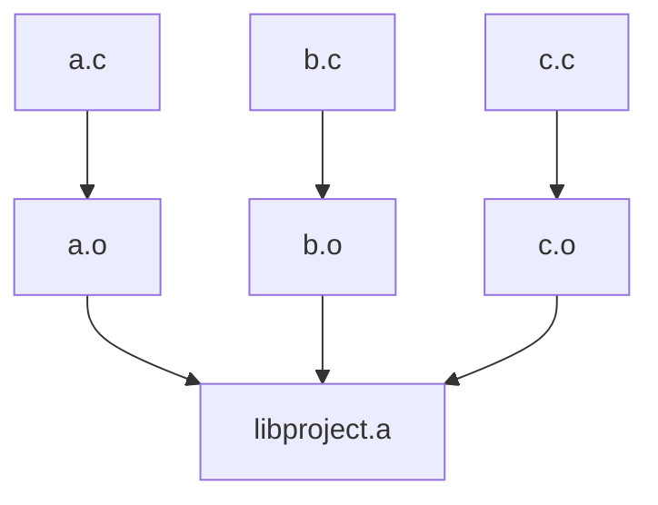
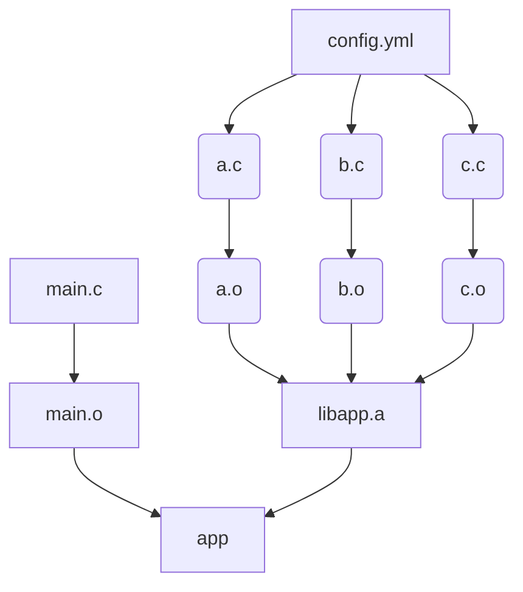

<!-- toc -->


# expand

## usual cases, all files are known

Standard makefiles define rules, eg :
```make

%.o : %.c
    gcc -c $< -o $@

libproject.a : a.o b.o c.o
    ar rcs $@ $^
```

which build the graph :



---

## now we have code generators, lists of files are unknown

Now, image that the list of files is unknown, because we have a code generator `cg`, that takes an input file `config.yml`.
Our Makefile would be the impossible : 

```make

%.o : %.c
    gcc -c $< -o $@

unknown list of files : config.yml
    cg $^

libproject.a : unknown list of files
    ar rcs $@ $^

```

Usual solution with make would be to have a directory or filename pattern for the generator, and use a wildcard.

---

## yamake expand

Yamake has another approach, names expansion. Our initial known graph has nodes `main.c`, `main.o`, `app`, `libapp.a` and `config.yml`.
We have a code generator that will generate cfiles from `config.yml`, but we don't have that list.

Yamake allows nodes to have an `expand` method. In our example, the expansion will create 6 nodes : `a.c`, `a.o`, ... and the edges, this is shown in orange.


