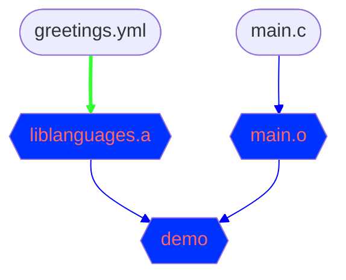
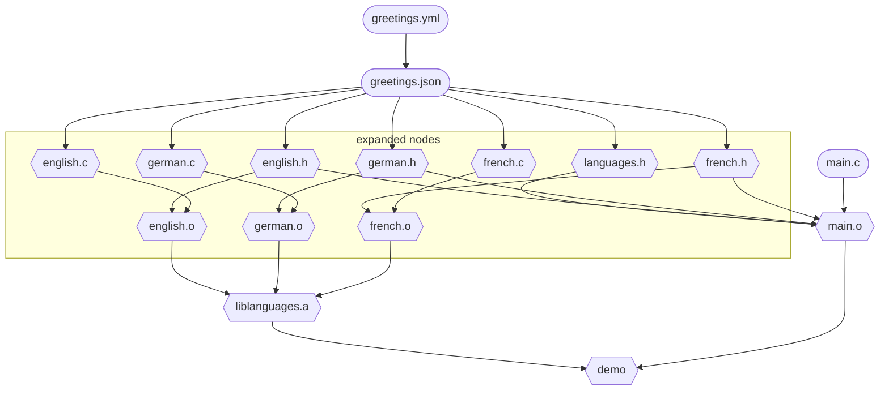

<!-- toc -->

# first

first we have a description of messages in different languages, in a yaml file. 

we have a code generator, written in rust. The code source is part of the project

This will generate C files, and we have our `main.c` that will print some messages
file `greetings.yml`

```yml
{{#include ../../demo_projects/demo_expand/greetings.yml}}
```

from the `greetings.yaml` file C files and H files will be generated, but for now we don't have this list so we cannot build the build graph,
so our graph looks like this but is incomplete


we have 
- `greetings.yml` and `main.c` are source files, and will be mounted
- `main.o` will be compiled from `main.c` ( we miss header files )
- executable file `demo` will be the product of linking `liblanguages.a` and `main.o`
- and .... `liblanguages.a` is a library that will be built from C files, generated from greetings.yml, we miss these files yet

the Green arrow shows the dependency, it will trigger the expansion.




---

# one solution

one solution would be to call the code generator, get the list of generated files, and construct our build graph.
this would work here, but not in a more general situation, where the generated files will also be used to build other tools, that will also generate other files


---

# chosen solution

for each node, we have an `expand` trait. It usually does nothing, but, in our case, `expand` will :
- generate the files in the sandbox
- add these files to the graph
- add edges


---

# the final graph

we have the nodes

- in orange the sources
- in lavender with green dotted border, expanded nodes, and file is generated in sandbox
- in blue with green dotted border, expanded nodes, these are `.o` files, they will be built later
- in blue the compiled files 

and the edges :

- in red, the generation of code
- in green the expansion
- in blue, the compilation and link of C source code
- in dotted, scanning of `#include` transitive directives





