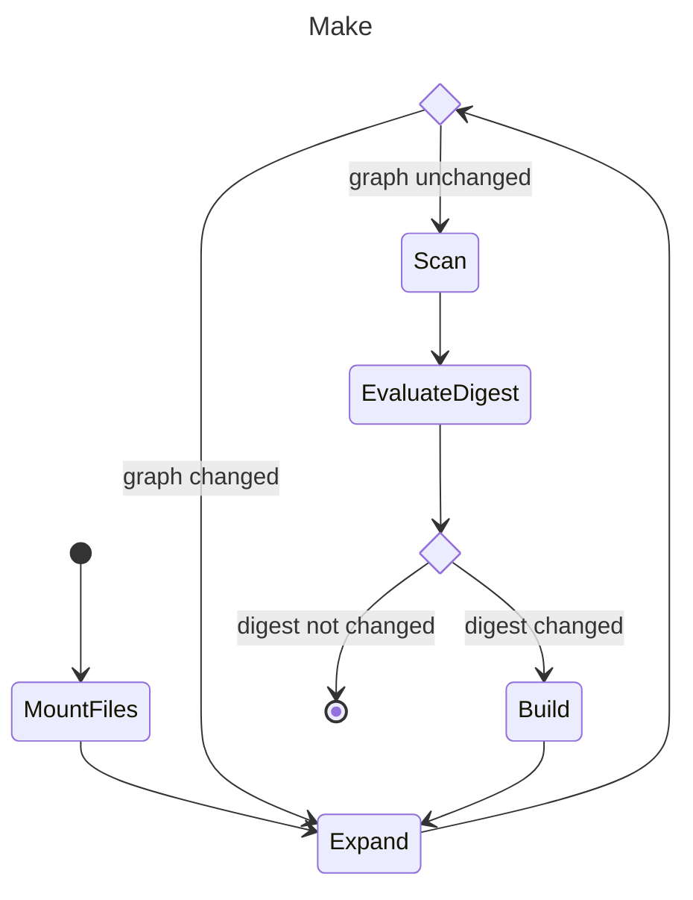

<!-- toc -->

# make diagram

```mermaid

---
title: Make
---
stateDiagram-v2

    state if_state_expand <<choice>>
    state if_digest_changed <<choice>>


    [*] --> MountFiles
    MountFiles --> Expand
    Expand --> if_state_expand
    if_state_expand --> Expand: graph changed
    if_state_expand --> Scan : graph unchanged
    Scan --> EvaluateDigest
    EvaluateDigest --> if_digest_changed
    if_digest_changed --> Build: digest changed
    if_digest_changed --> [*]: digest not changed
    Build --> Expand


```