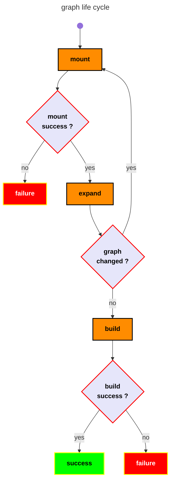

<!-- toc -->

# Graph life 
[top](#top)

---

# node type
[top](#top)

<!-- mermaid version 

```mermaid
info
```
-->

```mermaid

---
title: graph life cycle
---

flowchart 

start@{ shape: f-circ}

start --> mount:::action

mount --> decision_mount


decision_mount{
    mount
    success ?
}:::choice

decision_mount -- no --> failure

failure[
    failure
]:::ko

decision_mount -- yes --> expand:::action

decision_graph_changed{
    graph
    changed ?
}:::choice

expand --> decision_graph_changed

decision_graph_changed -- yes --> mount

decision_graph_changed -- no --> build_not_changed
build_not_changed[build]:::action

decision_build{
    build
    success ?
}:::choice

build_not_changed --> decision_build

decision_build -- yes --> build_ok
build_ok[success]:::ok

decision_build -- no --> build_failure
build_failure[failure]:::ko


classDef ko fill:#f00,color:white,font-weight:bold,stroke-width:2px,stroke:yellow
classDef changed fill:#0ff,color:black,font-weight:bold,stroke-width:2px,stroke:yellow
classDef unchanged fill:#0f0,color:black,font-weight:bold,stroke-width:2px,stroke:yellow

classDef ok fill:#0f0,color:black,font-weight:bold,stroke-width:2px,stroke:yellow

classDef action fill:#FF8C00,color:black,font-weight:bold,stroke-width:2px,stroke:black,shape:bolt
classDef choice fill:lavender,color:black,font-weight:bold,stroke-width:2px,stroke:red,shape: circle


```

---

