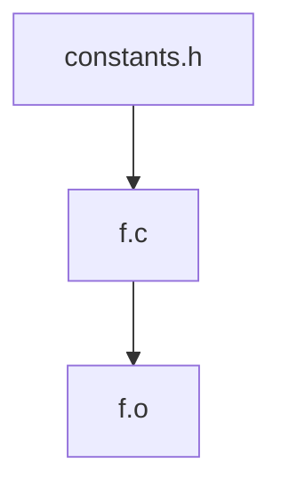
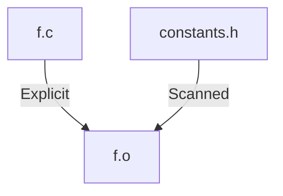

# scan ( optional )

```rust
{{#include ../../src/model.rs:scan}}
```

scanning a node means returning a list of paths, that the nodes depends on. At scan time, yamake will add an edge for each scanned dependency

---

## what is a dependency ?

let's consider the code `constants.h` file :

```C
#define SOME_CONSTANT 42 ;
```

and this file `f.c`

```C
#include "constants.h"

int f(int a, int b) {
    return 2 SOME_CONSTANT ;
}
```

and, when you compile `f.c`, you get `f.o`.

We might consider that `f.c` depends on `constants.h`, because of the include instruction.
But, as with the regular make tool, the dependency means when do we need to rebuild a target ? So the dependency is with respect to `f.o`.
Whenever `constants.h` changes, `f.o` needs to be rebuilt

### no !
> [!WARNING]

This is not the correct way of seeing a dependency. If constants.h changes, f.o needs to be rebuilt



### yes !

This is the correct way. If either f.c or constants.h change, f.o needs to be rebuilt.




---

## example

this is the scanner of the .o files, in Ofile. It :

- checks that the Ofile has exactly one .c source file predecessor
- recursively parses the .c files and the .h included files
- only the files that are in the sandbox are returned

```rust
{{#include ../../yamake/src/c_project/o_file.rs:scan}}
```


files that are not in the sandbox are ignored. This can be a scanning error. Remember that scanning is for fast dev iterations. When going to prod
you will build from a clean sandbox.

Anyway github actions (or other CICD tool) will enforce that.

---

source of the scanner. It recursively looks for `#include` instructions, and only keep these that are found in the sandbox

@todo: build dependencies ?????

```rust
{{#include ../../yamake/src/c_project/c_scan.rs:c_file_scan}}
```
