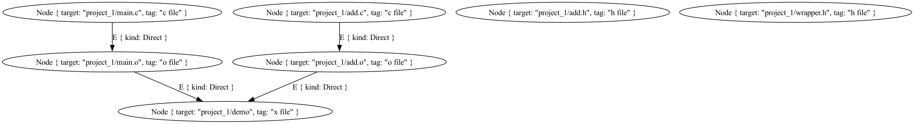

# scan

The scan will add new nodes to the graph :

```rust
{{#include ../../../yamake/examples/c_project_demo/main.rs:scan}}
```

after the scan, we will have 3 new edges :
- main.o depends on add.h and wrapper.h
- add.o depends on add.h




---

the edges that were added by the scan are labeled `Scanned`

---

*scan is done in the sandbox : it only adds edges between existing nodes, it does not add nodes*

the scan reads the source files, and tries to find dependencies. So in our example, main.o depends on main.c, and therefore this file is scanned.
But if add.h was forgotten in the graph, this dependency will be ignored.

---

the scan is used to determine, using files digest, if a successor node needs to be rebuilt. So if the scanner is not correct, the build will be fine,
but the feature *rebuild only what is necessary* will not work correctly.
