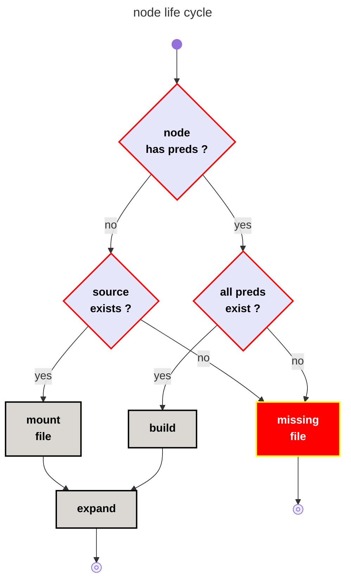
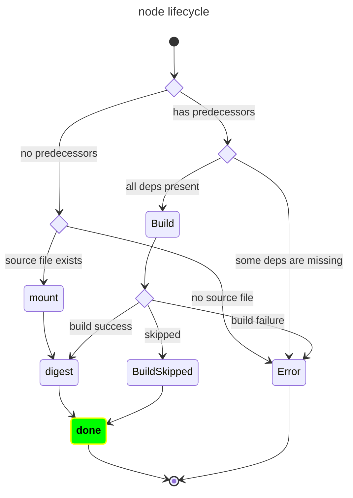
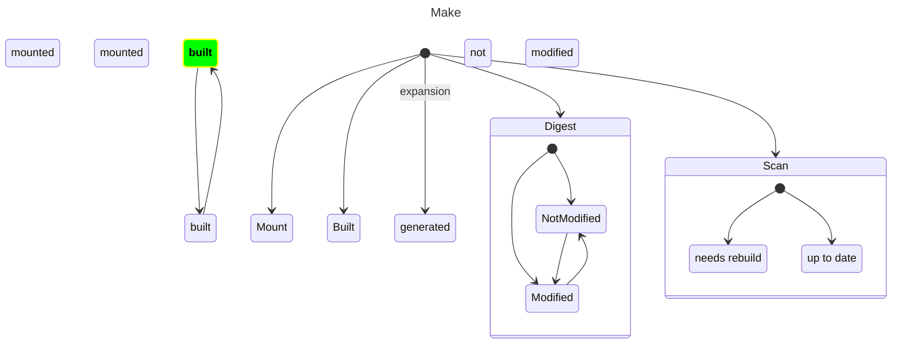

<!-- toc -->

# Node life cycle
[top](#top)

# node target
[top](#top)

The target of a node is a file in the sandbox. `node <=> target` is a 1-1 relation.

---

# node type
[top](#top)

<!-- mermaid version 

```mermaid
info
```
-->





---

## other




---



