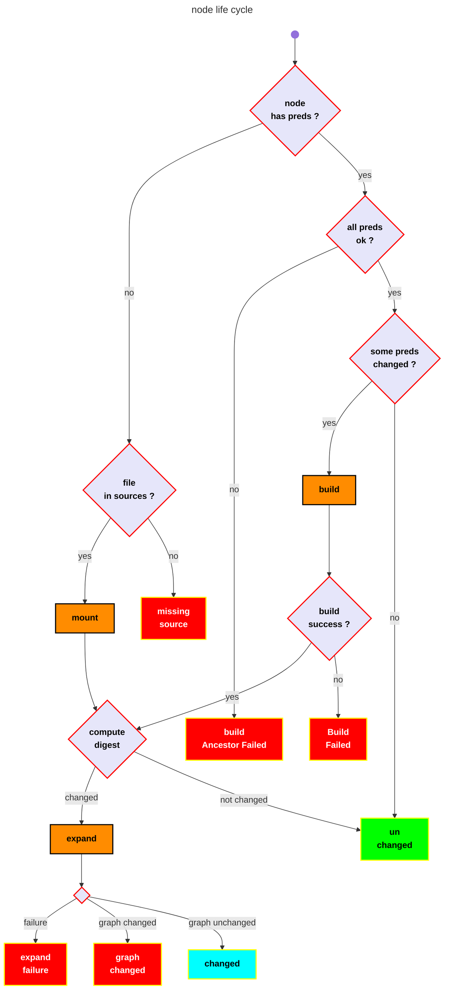

<!-- toc -->

# Node life cycle
[top](#top)

# node target
[top](#top)

The target of a node is a file in the sandbox. `node <=> target` is a 1-1 relation.

---

# node type
[top](#top)

<!-- mermaid version 

```mermaid
info
```
-->




---

# digest

digest of nodes are stored in a cache file. The first time the tool is ran, the digest is missing. If not, the action of computing the digest allows
to node to be marked as changed or unchanged since the last run.

---

# source node
[top](#top)

a source node has no predecessor. It is a file in the source directory, and there is no rule to build it, it is mount, ie copied from source directory to sandbox. When mounted, its digest is compared to the old one.

---

# expand

Expanding a node means adding nodes and edges to the build tree.


