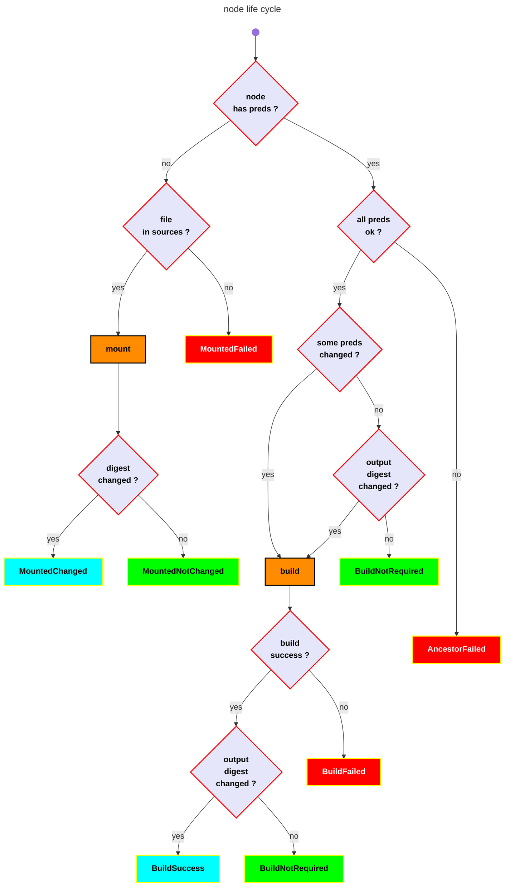

<!-- toc -->

# Node life cycle
[top](#top)

# node target
[top](#top)

The target of a node is a file in the sandbox. `node <=> target` is a 1-1 relation.

---

# node statuses
[top](#top)

Each node has a status that tracks its state during the build process:

| Status | Description |
|--------|-------------|
| `Initial` | Node has not been processed yet |
| `MountedChanged` | Source file mounted, digest changed since last build |
| `MountedNotChanged` | Source file mounted, digest unchanged |
| `MountedFailed` | Failed to mount source file |
| `Running` | Node is currently being built |
| `BuildSuccess` | Build completed successfully with changed output |
| `BuildNotRequired` | Build skipped (predecessors unchanged and output digest matches) |
| `BuildFailed` | Build failed |
| `AncestorFailed` | Skipped because a predecessor failed |

---

# node type
[top](#top)

<!-- mermaid version

```mermaid
info
```
-->




---

# digest

Digests (SHA256 hashes) of nodes are stored in `make-output.yml` in the sandbox. The file contains an array of `OutputInfo` entries:

```yaml
- pathbuf: project_1/main.c
  status: MountedNotChanged
  digest: 5ebac2a26d27840f79382655e1956b0fc639cbdca5643abaf746f6e557ad39b8
- pathbuf: project_1/main.o
  status: BuildNotRequired
  digest: ec1a9daf9c963db29ba4557660e3967a6eeb38dab5372e459d3a1be446c38417
```

On subsequent builds, digests are compared to determine if files have changed:
- **Source files**: Compared before mounting to set `MountedChanged` or `MountedNotChanged`
- **Built files**: Compared after build to set `BuildSuccess` or `BuildNotRequired`

---

# source node
[top](#top)

A source node has no predecessor. It is a file in the source directory, and there is no rule to build it. It is mounted (copied from source directory to sandbox). When mounted, its digest is compared to the previous digest stored in `make-output.yml`.

---

# incremental builds

The build system supports incremental builds by tracking:
1. **Source file digests**: Detect when source files change
2. **Output file digests**: Avoid rebuilding when output would be identical
3. **Predecessor statuses**: Skip builds when all predecessors are unchanged

When all predecessors have status `MountedNotChanged` or `BuildNotRequired`, the output file is checked:
- If it exists and its digest matches the previous build, status is set to `BuildNotRequired`
- Otherwise, the build runs and the result is compared to set `BuildSuccess` or `BuildNotRequired`

---
