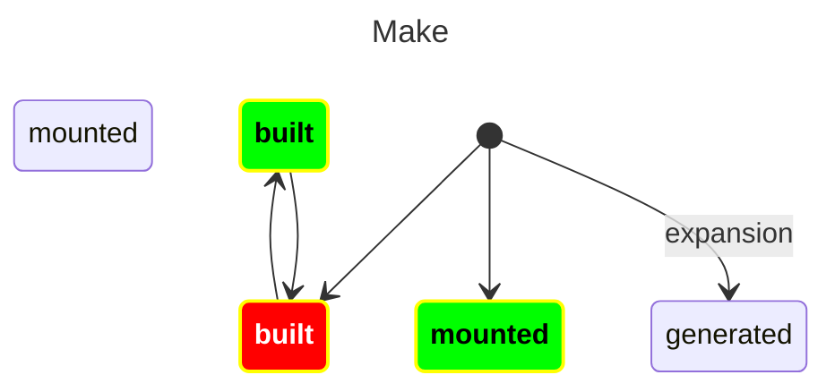

<!-- toc -->

# Node life cycle

```mermaid

---
title: Make
---
stateDiagram-v2
        MountedOk: mounted
        MountedKo: mounted
        BuiltOk: built
        BuiltKo: built
        %% Missing: not present in sources

        [*] --> MountedOk:::ok 
        [*] --> BuiltKo:::ko
        [*] --> generated : expansion
        BuiltOk:::ok --> BuiltKo
        BuiltKo --> BuiltOk
        %% MountedKo --> MountedOk:::ok

        


classDef ko fill:#f00,color:white,font-weight:bold,stroke-width:2px,stroke:yellow
classDef ok fill:#0f0,color:black,font-weight:bold,stroke-width:2px,stroke:yellow

%%class Mounted badBadEvent
%%class Expanded ok

```

