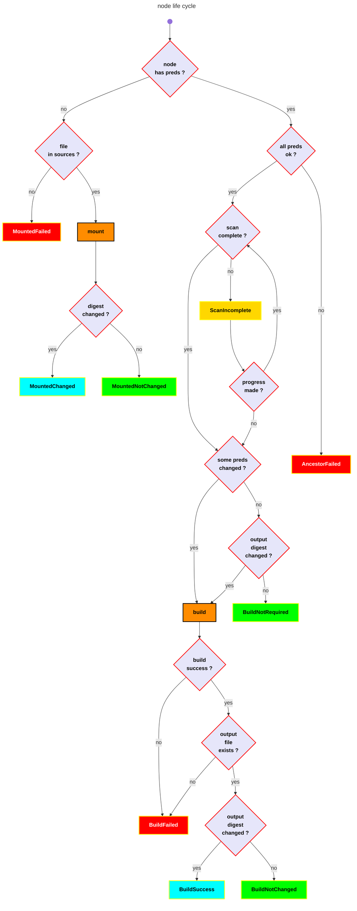

<!-- toc -->

# Node life cycle
[top](#top)

# node target
[top](#top)

The target of a node is a file in the sandbox. `node <=> target` is a 1-1 relation.

---

# node statuses
[top](#top)

Each node has a status that tracks its state during the build process:

| Status | Description |
|--------|-------------|
| `Initial` | Node has not been processed yet |
| `MountedChanged` | Source file mounted, digest changed since last build |
| `MountedNotChanged` | Source file mounted, digest unchanged |
| `MountedFailed` | Failed to mount source file |
| `ScanIncomplete` | Waiting for dependencies to be generated (e.g., by expand) |
| `Running` | Node is currently being built |
| `BuildSuccess` | Build completed successfully with changed output |
| `BuildNotChanged` | Build completed successfully but output unchanged |
| `BuildNotRequired` | Build skipped (predecessors unchanged and output digest matches) |
| `BuildFailed` | Build failed, or build succeeded but output file missing |
| `AncestorFailed` | Skipped because a predecessor failed |

---

# node type
[top](#top)

<!-- mermaid version

```mermaid
info
```
-->




---

# digest

Digests (SHA256 hashes) of nodes are stored in `make-report.yml` in the sandbox. The file contains an array of `OutputInfo` entries:

```yaml
- pathbuf: project_C/main.c
  status: MountedNotChanged
  digest: 5ebac2a26d27840f79382655e1956b0fc639cbdca5643abaf746f6e557ad39b8
  absolute_path: /path/to/sandbox/project_C/main.c
  stdout_path: null
  stderr_path: null
  predecessors: []
- pathbuf: project_C/main.o
  status: BuildNotRequired
  digest: ec1a9daf9c963db29ba4557660e3967a6eeb38dab5372e459d3a1be446c38417
  absolute_path: /path/to/sandbox/project_C/main.o
  stdout_path: /path/to/sandbox/logs/project_C/main.o.stdout
  stderr_path: /path/to/sandbox/logs/project_C/main.o.stderr
  predecessors:
  - pathbuf: project_C/main.c
    status: MountedNotChanged
```

Each entry includes:
- `pathbuf`: Relative path to the file
- `status`: Final node status after build
- `digest`: SHA256 hash of file contents
- `absolute_path`: Absolute path to the output file
- `stdout_path` / `stderr_path`: Paths to build log files (null for source files)
- `predecessors`: List of direct predecessors with their status

On subsequent builds, digests are compared to determine if files have changed:
- **Source files**: Compared before mounting to set `MountedChanged` or `MountedNotChanged`
- **Built files**: Compared after build to set `BuildSuccess` or `BuildNotRequired`

---

# source node
[top](#top)

A source node has no predecessor. It is a file in the source directory, and there is no rule to build it. It is mounted (copied from source directory to sandbox). When mounted, its digest is compared to the previous digest stored in `make-report.yml`.

---

# incremental builds

The build system supports incremental builds by tracking:
1. **Source file digests**: Detect when source files change
2. **Output file digests**: Avoid rebuilding when output would be identical
3. **Predecessor statuses**: Skip builds when all predecessors are unchanged

When all predecessors have status `MountedNotChanged`, `BuildNotChanged`, or `BuildNotRequired`, the output file is checked:
- If it exists and its digest matches the previous build, status is set to `BuildNotRequired`
- Otherwise, the build runs and the result is compared:
  - `BuildSuccess` if output digest changed
  - `BuildNotChanged` if output digest is unchanged (e.g., adding a comment to source)

---

# parallel builds

Builds are executed concurrently using [Rayon](https://docs.rs/rayon). Nodes at the same dependency level can be built in parallel, while respecting the dependency graph.

The build phase operates in three stages:
1. **Categorization** (sequential): Determine which nodes are ready to build
   - Mark `AncestorFailed` for nodes with failed predecessors
   - Mark `BuildNotRequired` for nodes with unchanged predecessors and matching output digest
   - Collect nodes ready to build (all predecessors ready, no failures)
2. **Build** (parallel): Execute builds concurrently using `rayon::par_iter()`
   - After each build succeeds, verify the output file exists at the expected pathbuf
   - If the output file is missing, mark the node as `BuildFailed`
3. **Status update** (sequential): Apply build results to node statuses

This approach maximizes parallelism while ensuring correct dependency ordering.

---
