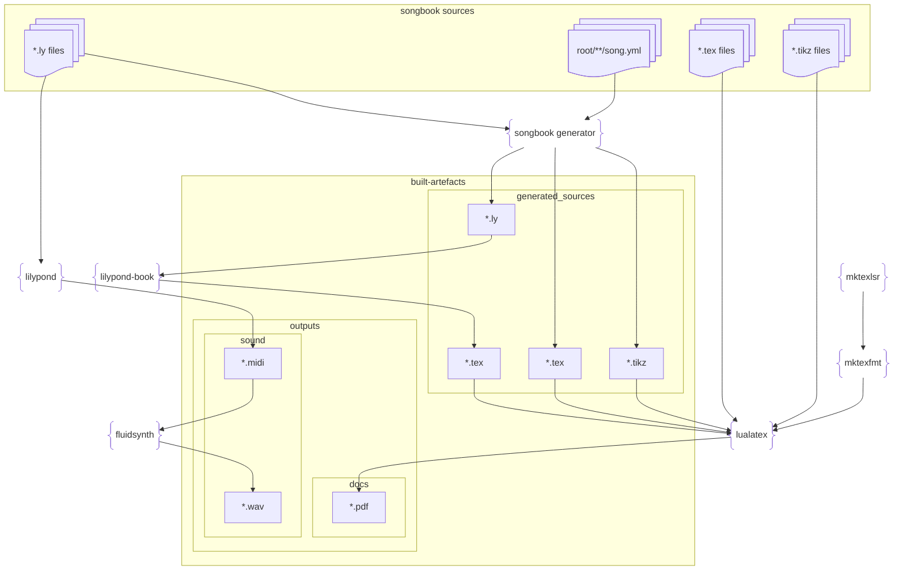

<!-- toc -->

# What is it ?
[top](#top)

this is yet another makefile tool.

In this page, we go through the
- [motivation for a new tool](#Motivation)
- [how we would do it with a standard Makefile](#Makefile-solution)
- [the problems with Makefile](#make-issues)
- [the features of yamake (this tool)](#features)

---

# Motivation
[top](#top)

This is motivated by the following situation : imagine you write a project called `songbook-generator` which goal is to generate pdf and wav files for a songbook, and this for namy songs. It is also able to merge songs into a book to provide a setlist.

So you write a rust project, that will read inputs
for instance yml files, chunks of LaTeX files, lilypond snippets, and then generates other latex files, other lilypond files, other tikz files.

And then you need to run `lualatex`, `lilypond`, `fluidsynth` to generate your pdf, midi and wav outputs. And there are hundreds of them, and because
a lot of code is generated you have to do it in an exact order. You also want to run other tex tools because you have your own custom fonts.

So you need a build tool

---

# Makefile solution
[top](#top)

One solution is to have your project generate a Makefile, run make, and then scan the output directory to check generated artefacts.
Because you know your build graph, make isn't such a big help as you can walk the graph yourself.

On top of that, we have some issues with make that we really want to get rid of :

- [recursive makefile considered harmful](#recursive-makefile-condidered-harmful)
- [using timestamps](#using-timestamps), especially if you have generated code
- [scanning](#scanning), especially scanning non existing dependencies !
- [typo-error](#typo-error)

---

# make issues
[top](#top)

## recursive makefile condidered harmful
[top](#top)

this is a well known problem, you can follow this link :
[recursive makefile considered harmful](https://accu.org/journals/overload/14/71/miller_2004/)

this a quote of the article :

> [!CAUTION]
    - It is very hard to get the order of the recursion into the sub­directories correct. This order is very unstable and frequently needs to be manually ‘‘tweaked.’’ Increasing the number of directories, or increasing the depth in the directory tree, cause this order to be increasingly unstable.
    - It is often necessary to do more than one pass over the sub­directories to build the whole system. This, naturally, leads to extended build times.
    - Because the builds take so long, some dependency information is omitted, otherwise development builds take unreasonable lengths of time, and the developers are unproductive. This usually leads to things not being updated when they need to be, requiring frequent “clean” builds from scratch, to ensure everything has actually been built.
    - Because inter-directory dependencies are either omitted or too hard to express, the Makefiles are often written to build too much to ensure that nothing is left out.
    - The inaccuracy of the dependencies, or the simple lack of dependencies, can result in a product which is incapable of building cleanly, requiring the build process to be carefully watched by a human.
    - Related to the above, some projects are incapable of taking advantage of various “parallel make” impementations, because the build does patently silly things.

If you worked on big projects, you know what this is, especially the inter-directory dependencies

## using timestamps
[top](#top)

Make uses the timestamp of a target to determine if it needs to be rebuilt or not. Let's consider this scenario :

- you modify some code source, for instance add a comment in a C++ source file
- you run make
- because the C++ source file changed, you will rebuild the .o file, so its timestamp changes, and in cascade you will rebuild the libraries, the executables, the tests, ....

If you use timestamp, you will have :

- you modify some code source, for instance add a comment in a C++ source file
- you run make
- because the C++ source file changed, you will rebuild the .o file,
- but... the .o file digest does not change
- and the build stops here

This is all the more so bad if you have a code generator, for instance a protocol defined from description (remember corba ?),
or in my case lots of latex and tikz files generated from the description of a song.
You always rebuilt

## scanning
[top](#top)

Scanning is the action of adding dependencies by scanning a source file. A typical example is, when you have C source code, scan the .c file
to find the `#include` directives and add these files as dependencies. Same with C++, and, for my project, latex files, tikz files, lilypond files,...

We have two problems here :
- with make, you can add a scanner, but this is not easy to do

## typo error
[top](#top)

Consider this Makefile :

    x.o : x.c
        gcc -o blah.o $<

if file x.c is correct, running make will not yield an error, though the target x.o will not be built. For manually captured big makefiles, this is a real issue that produces bugs

## mount
[top](#top)

A nice feature of omake, not sure there is a make equivalent, is the vmount : all source files are copied to another directory, called builddir, and everybuild takes place there.
What is nice is that
- the source directory is not polluted with built artefacts
- you can just delete your build directory and rebuild if you need to.

## logs
[top](#top)

When you build a huge projects, you will have only two logs, the stdout and stderr, and can be thousands of line log. On top of that, if the build is parallelized,
log lines are untangled and just impossible to read.

---

## features
[top](#top)

`yamake` is a rust crate that allows you to build your own make function. You will :

- provide the rules to build and scan target
- build the graph
- run the make command

We will have these features :

- the build takes place in a sandbox, where the sources are copied first. This leaves the source tree clean.
- when make runs, digest of each node are written to disk. Subsequent runs will avoid build nodes that don't need to
- the scanner is provided by the user, using the library
- there is no cyclic dependency between directories as we have with make
- the the result of the build is written to a json file
- for each node, sdout and stderr of the build is dumped to files in the sandbox, so you have a log for each build rule
- output report is a json file, that you can easily query
