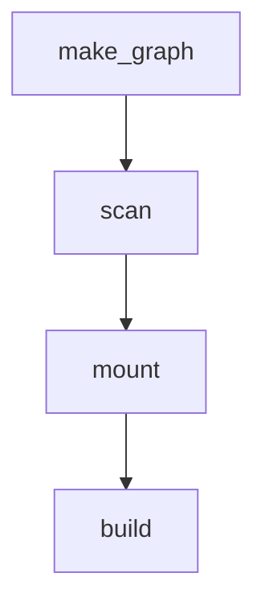

 
# this is yet another Makefile tool
 
 if you have a project, in C, LaTeX, Lilypond, whatever you can manually write a Makefile and run make to build a project.
 with generated code and the graph is dynamic, this can be difficult. Other features with regular Makefiles,
 such as scanning, sandbox, dynamic targets, timestamp, dependency cycles between directories

---
 
# this tool allows you to build the make graph, as a Rust project, with these features :
 
###  don't work in the sources directory, but in a sandbox. 

Every command and output artefacts are generated in a sandbox. This way the source directory does not get polluted.

### don't use the file timestamp but a digest to detect changes

If a target does not change after rebuild, this is detected. If a target has all its sources unchanged, it will not be rebuilt.
For instance, if you change a comment in a C file, the .o file will be recompiled but it will be unchanged, so the changes are not propagated
to the build tree

### scanned dependencies are managed

the provided scanner function will add edges to the graph.

### dependencies are tagged

---

# the workflow :

- user creates the graph, and populates it with nodes and edges. The source nodes are the nodes without predecessors
- the call `g.make`, this will
- mount the files that have 0 predecessors ( copy them from `srcdir` to `sandbox` )
- run the scan ( this will add edges between root nodes)
- run the build

# srcdir

all the sources of the project are relative to a root directory called `srcdir`

# sandbox

all the builds will take place in the sandbox. It can be safely deleted as the source files it contains are copied from srcdir.

# mount

mounting is the action of copying the file the `srcdir` to the `sandbox`

# scan

scanning a node is the action of reading a node file contents and detecting dependencies to other nodes. For instance, using the `#include` directory for C or C++ code.

Only source nodes are scanned. Note that scan does not add nodes, it only add edges. So for instance, for a C file, you will
need to add the H files to the graph yourself. Just scan the source directory.

